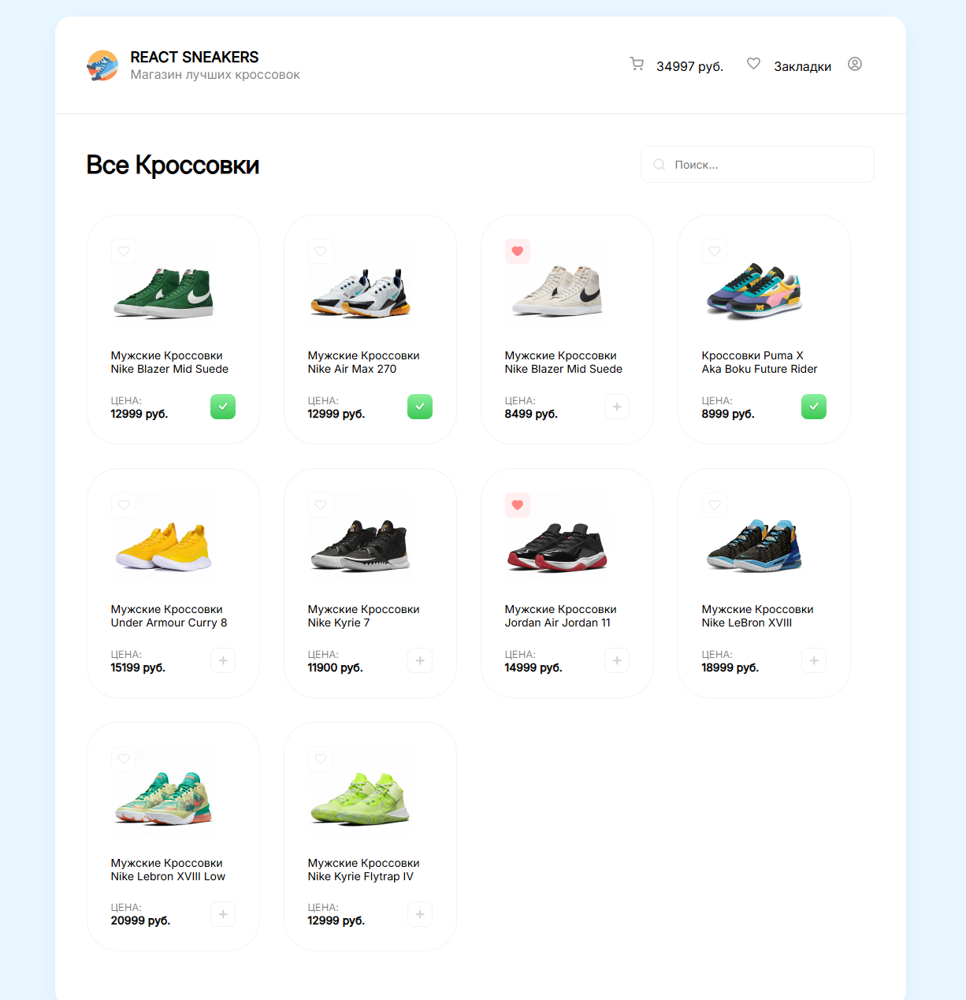

# Интеренет магазин кроссовок

## Описание:

*Разработан интернет-магазин кроссовок, где пользователи могут просматривать каталог, добавлять товары в корзину и оформлять заказы. Проект направлен на отработку ключевых навыков фронтенд-разработки.*

## Цель:

*Закрепить знания по React, управление состоянием, взаимодействие с API и создание удобного пользовательского интерфейса.*

## Функциональность:

- *Просмотр каталога товаров (карточки с изображениями и ценами).*

- *Добавление кроссовок в корзину.*

- *Реализация избранного (добавление и удаление товаров).*

- *Поиск товаров.*

- *Отображение состояния корзины (итоговая сумма, кнопка оформления заказа).*

- *Подключение к фейковому API (JSON Server).*

## Технологии:

- *Frontend: React, React Router.*

- *Стили: SCSS.*

- *Инструменты: Vite, Axios, Git.*

## Практическая направленность:

- *Развитие навыков работы с React (хуки, контекст, компоненты).*

- *Опыт работы с асинхронными запросами к API.*

- *Создание интерактивного интерфейса с управлением состоянием.*

## Результат:
Рабочий прототип интернет-магазина с удобным интерфейсом и базовым функционалом для покупок. Проект еще будет дорабатываться =) 

## Пример работы:

